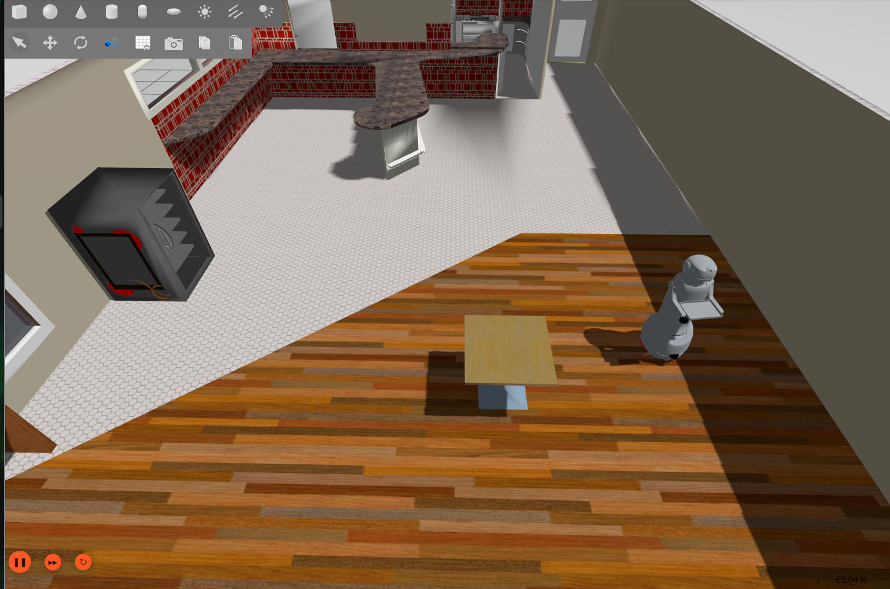
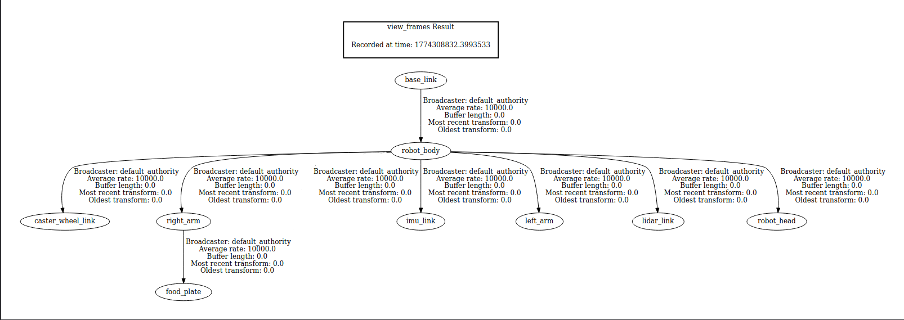
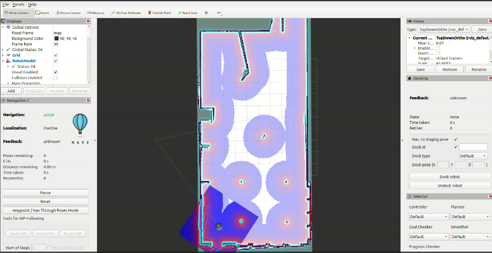
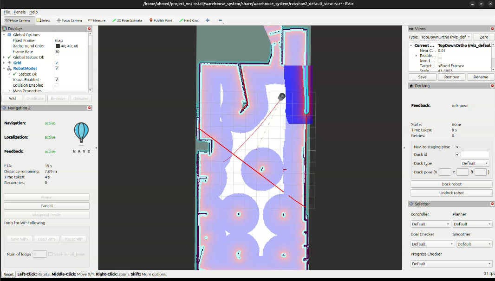

# ☕ ROS2 Autonomous Cafe Robot

A ROS2-based autonomous mobile robot designed to simulate real-world service scenarios in a café environment, focusing on navigation reliability, sensor fusion, and system integration.

---

## 🚀 Project Overview

This project implements a full robotics pipeline, from robot modeling to autonomous navigation, with an emphasis on building a system that behaves consistently rather than just functionally.

---
## 
Package Structure 
ros2_cafe_robot/
├── config/
│ ├── ekf.yaml # EKF sensor fusion config
│ ├── navigation_parameters.yaml # Nav2 full stack parameters
│ ├── ros2_controllers.yaml # Diff drive controller config
│ ├── ros_gz_bridge.yaml # Gazebo <-> ROS 2 topic bridges
│ └── nav_transform.yaml # NavSat transform (GPS, optional)
├── launch/
│ ├── navigation.launch.py # Full system: Gazebo + EKF + Nav2
│ ├── robot_ekf.launch.py # Gazebo + EKF only (no Nav2)
│ ├── robot_launch.launch.py # Gazebo + robot only
│ ├── ekf_launch.launch.py # EKF node only
│ ├── robot_state_publisher.launch.py
│ └── controllers.launch.py
├── maps/
│ └── cafe_world_map.yaml # Pre-built map of the cafe world
├── mesh/ # Robot 3D meshes (.dae)
├── model/
│ └── robot.xacro # Robot URDF/XACRO description
├── scripts/
│ ├── run_navigation.sh # Quick launch: full navigation
│ └── run_ekf.sh # Quick launch: robot + EKF only
├── worlds/
│ ├── cafe.world # Cafe simulation environment
│ └── empty.world # Empty world with GPS enabled
├── CMakeLists.txt
└── package.xml
---

## ⚙️ Core Capabilities

- Custom robot modeling using URDF
- Sensor integration (LiDAR, IMU)
- Motion control using ros2_control (diff drive)
- EKF-based sensor fusion for stable odometry
- SLAM-based mapping
- Autonomous navigation using Navigation2
- Command bridging between navigation and low-level controller
- Realistic café simulation environment in Gazebo

---

## 🏗️ System Architecture

The system is structured into:

- **Perception** → LiDAR, IMU
- **Localization** → EKF sensor fusion
- **Planning** → SLAM & Navigation2
- **Control** → ros2_control [Diff Drive Controller]

---

## 🎥 System Demonstration

### Mapping (SLAM)

### Autonomous Navigation

## 🔍 Engineering Insights

- Designed a consistent command flow from Navigation2 to low-level control
- Improved odometry stability using EKF fusion of IMU and encoder data
- Handled TF conflicts by isolating odometry sources
- Built a modular pipeline that reflects real-world robotics system design

---

## 🛠️ Tech Stack

- ROS2
- Python
- Navigation2
- robot_localization (EKF)
- Gazebo
- RViz

---

## 📬 Contact

**Ahmed Hassan**  

  

